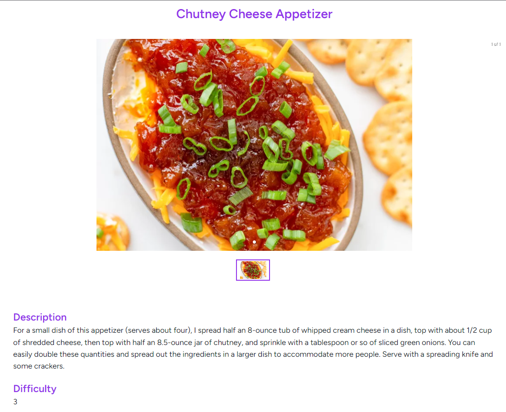

# Healthy lifestyle and physical training tracking application

## Abstract

Nowadays, with the continuous spread of technology, it is important to put an appropriate emphasis on our **health**, for example, on **proper nutrition** and **exercise**, as this helps avoid excess weight and the development of various diseases. Unfortunately, many people make the mistake of forgetting the importance of their health, neglecting it, not taking care of themselves and the outside world, as they are absorbed by the world of computers smartphones, and other smart devices.

The result of my thesis is a web application written with Laravel framework and React library, which focuses on **promoting a healthy lifestyle and physical training**. It provides many features, such as browsing recipes, viewing food charts of nutrients, food diary, browsing between workouts, exercise diary and body mass index calculator.

## Used Technologies

- Laravel
- React.js
- Inertia.js

## Presenting the application

### Welcome Page

### Register Form

### Recipes

### Recipe Detailed Page

### Nutrition Detailed & Calories Page

### Consumptions / Intake Nutrition Log

### Exercises

### Exercises / Workout Log

### Measurements

### Goals

### BMI Calculator

## How to run the application

1. PHP 8.1+ and MySQL must be installed. It's easiest if you download a development environment, like [Laragon](https://laragon.org/download/index.html).

2. Clone the repo

3. Register to [RapidAPI](https://rapidapi.com/justin-WFnsXH_t6/api/exercisedb) and get your key for ExerciseDB.
4. `cp .env.example .env`

5. Fill in the .env file
`RAPID_API_EXERCISEDB_KEY=`

(Also, don't forget to create a database and change the DB_DATABASE in the .env file. If you want to try out mailing with Mailbox.io, fill in the MAIL_USERNAME and
MAIL_PASSWORD in the .env file)

6. Start the MySQL in Laragon
7. `npm run dev`
8. `php artisan serve`
9. `php artisan migrate`
10. `php artisan db:seed`